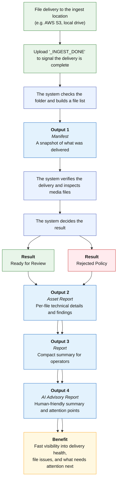

## Automated Ingest System

### 1. Purpose
This tool helps you confirm whether a file delivery is ready for review. After upload, it checks the delivery and provides clear reports so you can quickly understand the result, the file condition, and any issues that need attention.

### 2. Usage
Use this process when you are ready to submit a completed delivery package for system review.

### 3. System Diagram
### Simple process view

**Upload files → add `_INGEST_DONE` → system checks the delivery → system validates files → result is assigned → reports are created**



### 4. System Pipeline
#### 1) Upload the delivery files
User uploads all files for the delivery into the assigned ingest folder.

#### 2) Upload the completion marker
When the upload is fully complete, add a file named `_INGEST_DONE` into the same folder.

This file tells the system that the delivery is ready to be processed. The workflow starts only from this marker.

#### 3) Intake Check
The system checks that the folder is valid and that the delivery is properly formed.

This includes basic checks such as:
- the folder can be read
- files are present
- the delivery is not empty
- a stable inventory of files can be created

#### 4) Validation
The system then performs deeper validation on the files.

Depending on the delivery, this can include:
- checksum verification (comparing files with the `.mhl` file provided by the user)
- checksum baseline capture (`xxh64` checksum if no `.mhl` file is provided)
- media inspection
- media policy checks

#### 5) Media Inspection
In the current setting, media inspection checks the delivered files at a technical level and records the result in the asset and summary reports.

Current inspection results can include:
- file classification by type such as video, audio, image, subtitle, or non-media
- file counts by media type
- basic probe status such as whether a video or audio file is readable
- container and codec information
- duration, bitrate, resolution, frame rate, and timecode where available
- audio details such as codec, channels, channel layout, sample rate, and bit depth where available
- probe failure details when a file cannot be read properly

This helps users quickly understand what kind of files were delivered and whether the core media files are readable and structurally usable for the next stage.

#### 6) Result Assignment
The delivery is assigned one of two main results:
- **Ready for Review**: The delivery passed the required checks and can move to the next review stage.
- **Rejected Policy**: The delivery has issues that need to be corrected before it can move forward.

### 5. Outputs
1) **Manifest**: A record of what files were received in the delivery.
	- delivery snapshot of received files
	- file inventory
	- file size, ETag, and last modified data
	- ingest folder reference
	- ruleset version
	- validation timestamp and basic stats

2) **Asset Report**: A file-by-file technical report showing media details and findings. 
	- per-file technical details
	- file classification such as video, audio, image, subtitle, or non-media
	- checksum status by file
	- expected vs actual hash context where applicable
	- media probe results by file
	- readability / unreadability result
	- container, codec, duration, bitrate, resolution, frame rate, timecode, audio properties where available
	- file-level findings and mismatches
	- tooling information such as ffprobe availability
	- total findings count across assets
 
3) **Ingest Summary Report**: A compact operational summary of the delivery result. 
	- final workflow state
	- overall quality outcome
	- preflight validation result
	- compact deep-validation summary
	- checksum summary
	- media inspection summary counts
	- media policy summary
	- findings list
	- findings count
	- report location / output reference

4) **AI Advisory Report**: A simplified advisory summary designed to help people review the delivery more quickly. This report is helpful for guidance and prioritization, but the deterministic reports remain the authoritative source of truth.
	- human-friendly delivery headline
	- overall AI assessment such as healthy, warning, or at risk
	- operator brief
	- prioritized attention points
	- notable assets
	- recommended next action
	- advisory disclaimer
	- source artifact references
	- generation status such as success or fallback

### 6. Benefits
- Faster confirmation that a delivery has been checked
- Clear visibility into issues that need attention
- Consistent output reports for review and follow-up
- Easier understanding through a human-friendly advisory summary
- Better technical visibility into media readability and file-level media metadata

### 7. Version 2.0 Plan
The current 1.0 version is focused on ingest validation, reporting, and review readiness. In version 2.0, the plan is to expand the system beyond validation and add broader media processing and localization support.

Planned 2.0 directions include:
- deeper media processing functions after ingest validation
- expanded technical media analysis beyond the current probe-based inspection
- localization support functions built on top of the validated delivery package
- workflow extensions for downstream media and localization operations
- future AI-assisted analysis layers for richer operational support

##### Media processing
v2.0 is intended to add actual post-ingest media processing after the current validation gate. This means the platform would move from “validate and report” toward “validate, process, and route.” That future direction is already consistent with the original contract, which separates validation from later processing phases.

##### Localization workflow support
The validated manifest and asset intelligence can later be used to drive localization-related operations such as subtitle, dubbing, versioning, packaging, and downstream team handoffs. This is not part of the current v1.1 implementation, but it is a natural next layer for the platform.

##### AI video and image analysis
The current AI layer is deliberately limited to advisory reporting based on structured artifacts. v2.0 is planned to expand AI into richer media understanding, including future video/image analysis and deeper quality insight, while still keeping deterministic validation separate from AI interpretation. Direct video-content analysis and vision-based QC are explicitly outside the current v1 scope, making them a clear future expansion area.

##### Operational scalability
As the pipeline expands, runtime tuning will also become more important. Larger media files and more processing-heavy workflows will require careful configuration of timeout, memory, and parallel execution settings to balance speed, stability, and cost.

## Summary
The current Ingest Pipeline is a structured, auditable intake and validation service for media deliveries. It ensures that delivery packages are complete enough to proceed, captures trusted technical evidence, and produces clear reports for operators.

The v2.0 roadmap is to evolve that foundation into a broader media operations platform that can support media processing, localization workflows, and deeper AI-assisted video and image analysis.


---
---
#  Project Plan: Modular AI Content Intelligence (v2.0)

## 1. Purpose & Vision
The goal of v2.0 is to transform the ingest pipeline from a deterministic validation tool into a **Modular AI Content Platform**. Instead of a fixed sequence of events, users can select specific "Intelligence Modules" (Transcription, Vision, OCR) via a GUI based on the needs of the specific delivery.

---
## 2. Key Architectural Shifts
1.  **Linear to Modular:** Move from a "pass-through" pipeline to a "Hub & Spoke" model where services are invoked on-demand.
2.  **Best-of-Breed Models:** Moving beyond cloud-provider defaults to higher-accuracy models (e.g., OpenAI Whisper v3, GPT-4o, YOLOv10).
3.  **Proxy-First Processing:** Implementing an FFmpeg layer to extract lightweight audio and image artifacts, reducing AI compute costs by up to 80%.

---
## 3. The Tech Stack
*   **Orchestration:** AWS Step Functions (Asynchronous, state-managed).
*   **Pre-processing:** FFmpeg (Lambda Layers or Fargate).
*   **Audio Intelligence:** OpenAI Whisper v3 (Transcription & Language Detection).
*   **Visual Intelligence:** GPT-4o / Claude 3.5 Sonnet (Contextual Vision) & Google Video Intelligence (Brand/Logo Detection).
*   **GUI:** Retool / Appsmith (Internal) or React-based Custom Dashboard.
*   **Database:** DynamoDB (Job state & modular results).

---

## 4. Development Roadmap & Timeline

### Phase 1: FFmpeg Prep & Proxy Layer (Weeks 1–3)
**Goal:** Optimize media for AI consumption.
*   Develop a "Prep Service" to extract:
    *   **Audio:** 16kHz Mono MP3 for Whisper.
    *   **Visuals:** 720p I-frame extracts or Sprite Sheets (1 frame every 2 seconds).
*   Implement S3 lifecycle rules for automated cleanup of analysis proxies.

### Phase 2: Modular Orchestration (Weeks 4–6)
**Goal:** Build the "Menu" logic.
*   Configure Step Functions with "Choice States" based on user input.
*   Build parallel execution branches so Transcription and Vision can run simultaneously.
*   Develop the "Synthesis Lambda" to compile multiple module outputs into a single `ai_report.json`.

### Phase 3: Intelligence Modules (Weeks 7–11)
**Goal:** Deploy the "Best-of-Breed" workers.
*   **Module A (Audio):** Whisper v3 implementation (Speaker Diarization + Translation).
*   **Module B (Vision):** Logo/Brand detection + OCR for Slates and Credits.
*   **Module C (Pattern Recognition):** Using LLMs to compare extracted metadata against authoritative project rules.

### Phase 4: Control Gallery GUI (Weeks 12–15)
**Goal:** Put the operator in the driver's seat.
*   **File Browser:** Select assets from S3.
*   **Service Toggles:** Checkboxes for [x] Transcription, [ ] Brand Detection, [ ] Cast ID.
*   **Review Interface:** Synchronized video player + interactive transcript + timecoded visual flags.

---

## 5. Proposed Data Schema (ai_report.json v2.0)

```json
{
  "ai_report_version": "2.0",
  "job_metadata": {
    "modules_invoked": ["transcription", "brand_detection"],
    "total_compute_cost": "$1.42"
  },
  "audio_analysis": {
    "language": "en-US",
    "transcript_uri": "s3://.../transcript.vtt",
    "compliance_flags": [{"timestamp": "00:04:12", "type": "profanity"}]
  },
  "visual_analysis": {
    "detected_logos": [{"brand": "Nike", "timestamp": "00:10:05", "confidence": 0.99}],
    "slate_ocr": {"detected_title": "EP 101", "matches_metadata": true}
  },
  "recommended_action": "Proceed with Manual QC for brand clearance at 00:10:05."
}
```

---
## 6. Success Metrics & Guardrails

- **Accuracy:** Whisper Word Error Rate (WER) < 5%.
- **Cost Management:** AI analysis cost should not exceed $2.00 per hour of content for standard modules.
- **Latency:** Analysis results must be available in < 50% of the video's total duration.
- **Safety:** AI output is strictly advisory; human operators must "Verify & Commit" findings to the final job state.
---

## 7. Sample Cost Breakdown for Processing

### Part 1: Transcription (50 OCF Files x 3 mins = 150 Minutes)

**Tool: OpenAI Whisper API (Managed)**

- **The Math:** 150 minutes total.
- **Rate:** $0.006 per minute.
- **Total Cost:** **$0.90**
- **Note:** If you run this on your own AWS GPU (Fargate), the cost drops to roughly **$0.30** in compute time, but you have to manage the server.
- **Accuracy:** Whisper Word Error Rate (WER) < 5%.
- **Cost Management:** AI analysis cost should not exceed $2.00 per hour of content for standard modules.
---
### Part 2: Brand Detection (1 Master File x 120 Minutes)
This is where the price varies wildly depending on your strategy.

#### Option A: The "Brute Force" Way (Google Video Intelligence / AWS Rekognition)
These services scan every second of the video automatically.
- **Google Rate:** ~$0.15 per minute for Logo Recognition.
- **AWS Rate:** ~$0.10 per minute.
- **Total Cost:** **$12.00 – $18.00**

#### Option B: The "Optimized V2.0" Way (FFmpeg Sampling + GPT-4o-mini)
Instead of a "Video API," we extract 1 frame every 2 seconds and send them as a batch to a multimodal LLM.

- **The Math:** 120 mins = 7,200 seconds. 1 frame every 2 seconds = **3,600 images.**
- **GPT-4o-mini Rate:** ~$0.15 per 1,000 images (standard resolution).
- **Total Cost:** **$0.54**
- **Note:** This is "Sampling" logic. By choosing to sample, you save over **$11.00** on a single movie.
---
### Part 3: Infrastructure (FFmpeg + S3 + Lambda)

- **FFmpeg (Lambda):** Running 51 files through FFmpeg to extract audio and frames.
- **S3:** Data transfer and storage for the temporary proxies.
- **Total Cost:** **~$0.25**

  - **FFmpeg Compute (AWS Lambda):**
    - Processing a 3-minute OCF file to extract audio takes about 10–15 seconds on a well-configured Lambda.
    - Processing 50 files = ~750 seconds of compute.
    - Processing the 120-minute master (extracting 3,600 frames) might take 5–10 minutes.
    - **Cost:** AWS Lambda (1.5GB RAM) costs about $0.000025 per second.
    - Total Compute Cost: ~$0.05
        
- **S3 PUT Requests (The "Per-File" tax):**
    - Every time you save a frame or an audio file to S3, AWS charges for the "PUT" request.
    - 3,600 frames = 3,600 PUT requests.
    - **Cost:** $0.005 per 1,000 requests.
    - Total Request Cost: ~$0.02
        
- **Orchestration (AWS Step Functions):**
    - Each "step" in your workflow costs a tiny fraction of a cent ($0.000025 per state transition).
    - Total Orchestration Cost: ~$0.03
        
- **Data Transfer & Storage:**
    - Since your AI models and S3 buckets are in the same region, data transfer is **$0.00**.
    - Storing 1GB of "Analysis Proxies" for 24 hours costs essentially nothing ($0.0007).

**Total for Part 3: ~$0.10 - $0.25**

---
### Summary Table: The "Bill" for this Job

|                     |                             |                |
| ------------------- | --------------------------- | -------------- |
| Service             | Strategy                    | Estimated Cost |
| **Transcription**   | Managed Whisper API         | $0.90          |
| **Brand Detection** | Optimized Sampling (GPT-4o) | $0.54          |
| **Infrastructure**  | Lambda + S3                 | $0.25          |
| **TOTAL**           | **The v2.0 Modular Way**    | **$1.69**      |

---
### The Comparison
- **Using standard Video APIs:** This job would cost you roughly **$15.00 - $20.00**.
- **Using our Modular/Sampling Plan:** This job costs you roughly **$1.70**.

