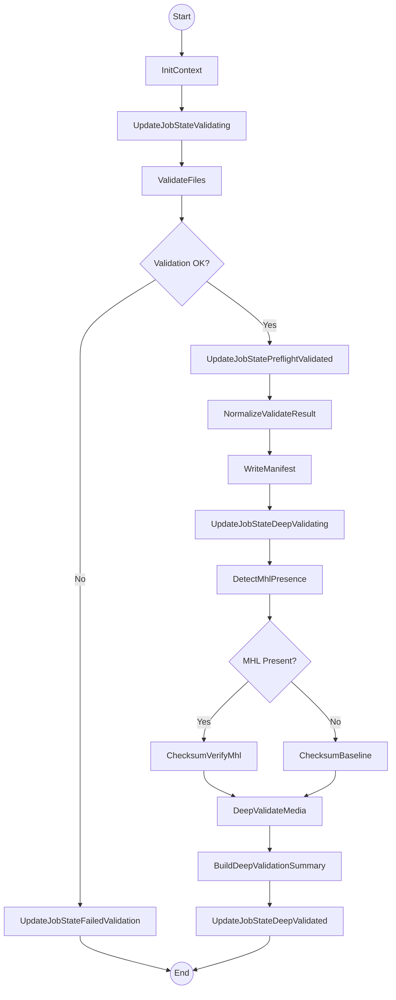

# Ingest State Machine Workflow (v1.1)

```mermaid
graph TD
    Start((Start)) --> InitContext
    InitContext --> UpdateJobStateValidating
    UpdateJobStateValidating --> ValidateFiles
    
    ValidateFiles --> ValidationChoice{Validation OK?}
    
    ValidationChoice -- No --> UpdateJobStateFailedValidation
    UpdateJobStateFailedValidation --> Done
    
    ValidationChoice -- Yes --> UpdateJobStatePreflightValidated
    UpdateJobStatePreflightValidated --> NormalizeValidateResult
    NormalizeValidateResult --> WriteManifest
    WriteManifest --> UpdateJobStateDeepValidating
    UpdateJobStateDeepValidating --> DetectMhlPresence
    
    DetectMhlPresence --> ChecksumModeChoice{MHL Present?}
    
    ChecksumModeChoice -- Yes --> ChecksumVerifyMhl
    ChecksumModeChoice -- No --> ChecksumBaseline
    
    ChecksumVerifyMhl --> DeepValidateMedia
    ChecksumBaseline --> DeepValidateMedia
    
    DeepValidateMedia --> BuildDeepValidationSummary
    BuildDeepValidationSummary --> UpdateJobStateDeepValidated
    UpdateJobStateDeepValidated --> Done
    
    Done((End))
```
